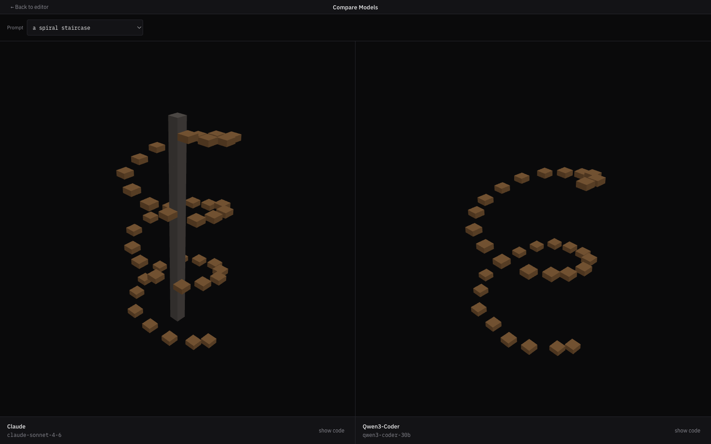
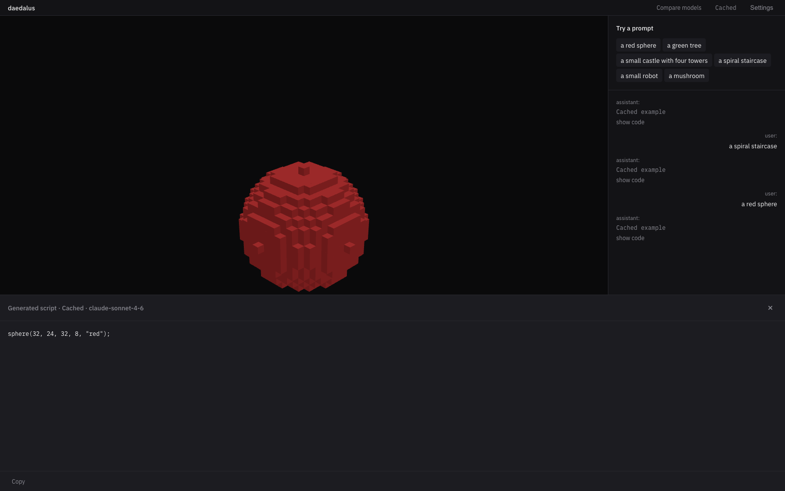

# daedalus

A browser-based demo of the **code-execution-tool-use pattern**: the LLM writes a short JavaScript program that calls a small voxel API, the program runs in a sandboxed Web Worker, and the result renders as a 64³ voxel scene in three.js.

Voxels are the medium. The pattern is the artifact.

## What you'll see

Open the page. A cached demo (`a small castle with four towers`) is already rendered — no key, no install, no configuration.

Click one of the six chips (`red sphere`, `green tree`, `castle`, `spiral staircase`, `robot`, `mushroom`) to browse the cached set. Or open Settings, paste an Anthropic API key or point at a local Ollama, and type your own prompt against a live model.

`Compare models` renders the same prompt through Claude and Qwen3-Coder side by side, under one shared orbit camera. Cached only — the visitor never needs both providers configured to see the comparison.



`Show code` on any generated result reveals the JavaScript the model actually wrote. That script IS the artifact — the voxel scene is just how you look at it.



## Quickstart

```bash
git clone https://github.com/itonskie/daedalus.git
cd daedalus
pnpm install
pnpm dev
```

Cached demos work with zero configuration. Everything else is opt-in.

## BYOK — Anthropic

- Open `Settings` in the top strip.
- Paste an Anthropic API key.
- Optionally pick a model (default: `claude-sonnet-4-6`).
- Key persists in `localStorage`. Nothing is sent anywhere except the Anthropic Messages API from your browser.

## BYOK — local Ollama

Install [Ollama](https://ollama.com) and pull a coder model:

```bash
ollama pull qwen3.6:27b-coding-nvfp4    # recommended, 19 GB
# or a lower-hardware fallback:
ollama pull qwen3.5:latest              # 6.6 GB, general-purpose
```

Then in `Settings`:
- URL (default `http://localhost:11434`)
- Model name

Toggle the active provider in the top strip.

## Regenerating the cached demos

The six cached demos live at `demos/<prompt-slug>/<model-slug>.js`, checked into the repo as plain JavaScript files so they diff cleanly in PRs.

```bash
# Requires ANTHROPIC_API_KEY and a running Ollama for the model slugs listed
# in demos/manifest.json. Fails loud when a provider isn't configured.
pnpm bench
```

## Architecture at a glance

Static frontend. Four deep modules behind small, stable interfaces. Thin React glue on top.

```
                 +---------------------+
                 |    React UI         |
                 |  (chat, viewport,   |
                 |   settings, code,   |
                 |   compare)          |
                 +----------+----------+
                            |
                    Zustand store
                            |
      +---------------------+---------------------+
      |                     |                     |
      v                     v                     v
+-----------+       +---------------+     +--------------+
| LLM       |       | Sandbox       |     | Voxel        |
| Provider  |       | Executor      |     | Renderer     |
| (deep)    |       | (deep)        |     | (deep)       |
+-----+-----+       +-------+-------+     +------+-------+
      |                     |                    |
  fetch to               Web Worker           three.js
  Anthropic /            (isolated)           InstancedMesh
  Ollama                     |
                             v
                     +---------------+
                     | Voxel API     |
                     | + Grid        |
                     | (deep)        |
                     +---------------+
```

- **LLMProvider** — one interface (`generateVoxelScript(prompt): Promise<string>`), two implementations (Anthropic, Ollama). Cached demos are not a provider; they're the store's default state.
- **Sandbox Executor** — Web Worker per generation. Injects the voxel API as globals. Catches syntax errors, runtime throws, timeouts, unknown palette colors, and returns a structured `{ grid, error?, durationMs }`.
- **Voxel API + Grid** — 64³ grid, 16-color named palette, four primitives (`place`, `box`, `sphere`, `line`). Frozen so the system prompt stays short and cached demos never break.
- **Voxel Renderer** — three.js `InstancedMesh` sized to occupied cells. Shared orbit camera across both panes in Compare view.

Full spec: [PRD #2](docs/specs/prds/2-daedalus-mvp-llm-generated-voxels.md). Engineering detail: [`docs/specs/engineering-spec.md`](docs/specs/engineering-spec.md).

## Stack

TypeScript / React 18 / Vite / three.js `InstancedMesh` / Zustand / Vitest / Biome. No backend, no build-time secrets — `pnpm dev` and static assets are the whole runtime.

## License

[MIT](./LICENSE)
